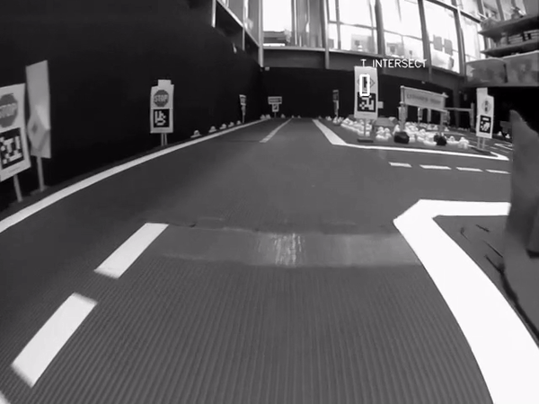

# Sirius-JBR-ETU -- Traffic Signs Detector

## Описание проекта
Автономные транспортные средства обладают обычно большим набором сенсоров, среди которых практически всегда есть камера. Используя алгоритмы компьютерного зрения, возможно получить большое количество ценной информации из окружающего мира, в частности - распознать знаки дорожного движения. Проект предполагает применение методов компьютерного зрения для следующих задач:
* Определение наличия знаков в кадре (есть или нет) 
* Поиск области изображения в которой есть знаки дорожного движения 
* Распознавание типов дорожных знаков найденных ранее на изображении 
  
Разработанное решение может быть использовано в исследовательских проектах направленных на разработку алгоритмов беспилотного управления транспортом, например, таких как Duckietown. Данный проект осуществляется совместно JetBrains Research ( АНО ДПО "НАУЧНО-ИССЛЕДОВАТЕЛЬСКИЙ И ОБРАЗОВАТЕЛЬНЫЙ ЦЕНТР "ДЖЕТБРЕЙНС") и СПБГЭТУ "ЛЭТИ".

## Описание решений 

1. Для каждого объекта(знака), который требовалось найти на исходном изображении, строился дескриптор(Математические описание объекта на изображение).
2. Для изображения строится математическое представление в виде массива ключевых точек.
3. Поиск кластеров в полученном массиве ключевых точек.
4. По полученым кластерам идет сравнение с дескриптором объекта. В случае большого процента совпадения кластер считается за объект.

> В различных решений использовали разные подходы для работы с изображением. В некоторых решениях используется размытие, увеличение/уменьшение размера изображения и так далее.

## Демо участников [09.2020 - 12.2020]

На данном изорбражении находятся два различных знака


На данном изображени находятся два различных знакам, один из них дублируется на изображении


<br>
Пример работы на видео
<br>



<details>
  <summary>Подробнее!</summary>
<br>


<br>

</details>

## Инструкция по запуску скрипта разметки `linear_markup.py`
### Список аргументов
Скрипт разметки `linear_markup.py` принимает *один обязательный аргумент* и *три необязательных аргументов*:
* `input_path` (строка): путь к видео/папке с элементами (видео/фото), которое(-ые) нужно разметить;
* `-p`, `--signs_path` (строка, необязательный): по умолчанию `"signs"`; путь к папке с изображениями знаков, которые требуется задетектировать;
* `-o`, `--output_path` (строка, необязательный): по умолчанию `"linear_markup_results"`; папка, в которую будут добавляться избранные изображения, а также `JSON`-файл с их разметкой;
* `-s`, `--skip` (целое число, необязательный): по умолчанию `24`; сколько кадров будет пропускаться после очередного размеченного кадра (доступно только для видео).

### Пример запуска
```Shell
python linear_markup.py "road_trip.mp4" -p "USA_road_signs" -o "my_results" -s 60
```

## Приобретенный опыт

* Опыт на языке программирования python3
* Опыт работы c библиотеками для высокоуровневых математических функций, в том числе и кластеризации
* Опыт работы с OpenCV

## Участники
### Студенты
* Бардин Петр ([github_profile](https://github.com/BardinPetr))
* Комаров Даниил ([github_profile](https://github.com/qmaster0803))
* Савинов Даниил ([github_profile](https://github.com/SaviDan245))
* Иванов Егор ([github_profile](https://github.com/sibenshtern))
* Астафуров Данил ([github profile](https://github.com/danil31219as))
* Арина Гончарова ([github_profile](https://github.com/arinagoncharova2005))
* Ивова Олеся ([github_profile](https://github.com/lvovaa))

### Наставники
* Государкин Ярослав ([github_profile](https://github.com/DarkFlink))
* Глазунов Сергей ([github_profile](https://github.com/light5551))
